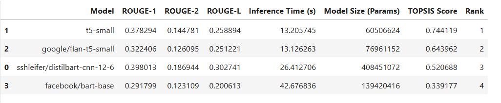
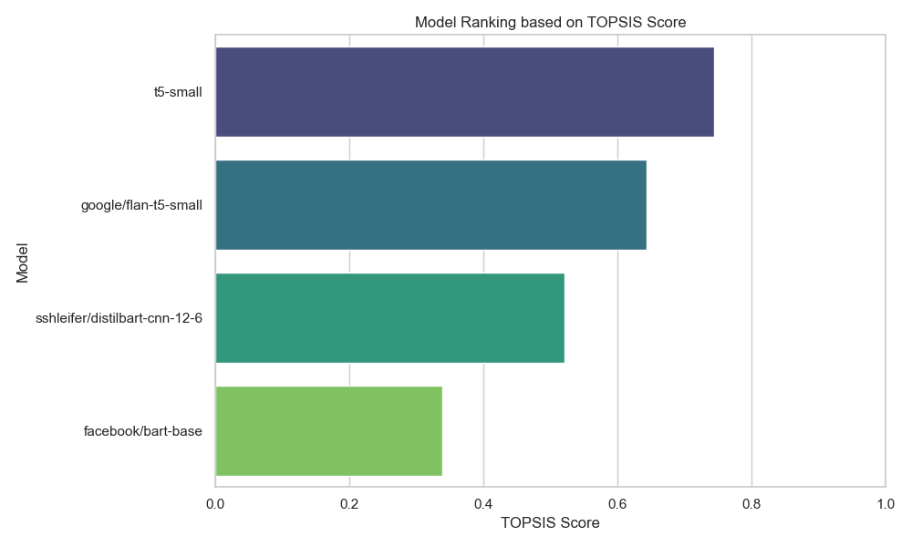
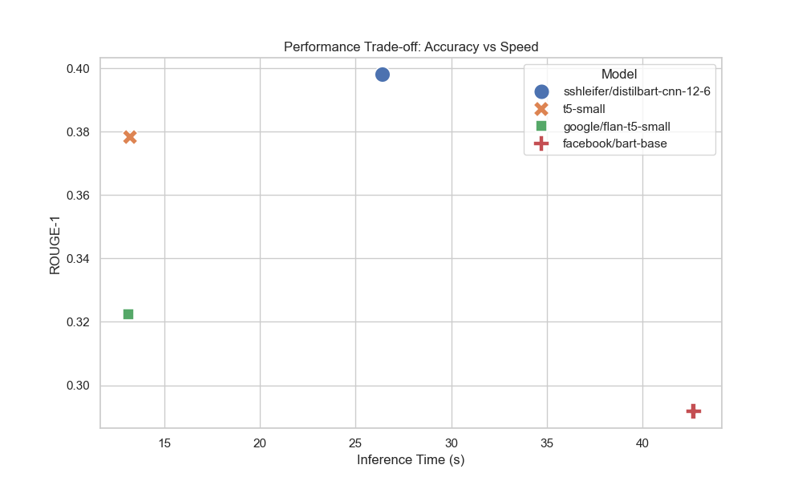

# TOPSIS-Based Evaluation of Pre-Trained Models for Text Summarization

## Project Overview
This repository contains a comprehensive evaluation of various pre-trained Natural Language Processing (NLP) models for the task of **Text Summarization**. The evaluation is performed using the **TOPSIS** (Technique for Order of Preference by Similarity to Ideal Solution) multiple-criteria decision-making method to find the optimal balance between accuracy, speed, and size.

## Models Evaluated
The following lightweight seq2seq models were tested:
1. **`sshleifer/distilbart-cnn-12-6`**: Optimized and distilled version of BART.
2. **`t5-small`**: Google's lightweight Text-to-Text Transfer Transformer.
3. **`google/flan-t5-small`**: T5 fine-tuned on a mixture of tasks.
4. **`facebook/bart-base`**: Standard base architecture of BART.

## Dataset & Evaluation Metrics
The models were benchmarked on a sample of the **CNN/DailyMail** dataset. The decision matrix for TOPSIS was constructed using five key parameters:

| Criterion | Description | Impact | Weight |
|-----------|-------------|--------|--------|
| **ROUGE-1** | Overlap of unigrams (Accuracy) | Positive (+) | 0.25 |
| **ROUGE-2** | Overlap of bigrams (Accuracy) | Positive (+) | 0.25 |
| **ROUGE-L** | Longest common subsequence (Fluency) | Positive (+) | 0.25 |
| **Inference Time** | Time taken to generate summaries (Speed) | Negative (-) | 0.15 |
| **Model Size** | Total number of trainable parameters (Efficiency)| Negative (-) | 0.10 |

## The TOPSIS Algorithm
The final ranking score ($S_i$) for each model is calculated based on its Euclidean distance from the ideal best ($D_i^+$) and ideal worst ($D_i^-$) solutions:

$$S_i = \frac{D_i^-}{D_i^+ + D_i^-}$$

Where a score closer to $1$ represents the most optimal trade-off between text summarization accuracy, inference speed, and memory footprint.

## Final Results
Below is the final decision matrix, TOPSIS scores, and the generated rankings.



## Visualizations
To better understand the comparative performance, the following graphs were plotted:

### 1. Overall Model Ranking
This bar chart illustrates the final TOPSIS scores, highlighting the best overarching model for this specific summarization task.



### 2. Performance Trade-off (Accuracy vs. Speed)
This scatter plot maps the ROUGE-1 score against the Inference Time, visually demonstrating the trade-off between highly accurate models and fast, lightweight models.



## ⚙️ How to Run
1. Clone this repository to your local machine.
2. Install the required dependencies:
   ```bash
   pip install transformers datasets evaluate rouge_score torch pandas numpy matplotlib seaborn
